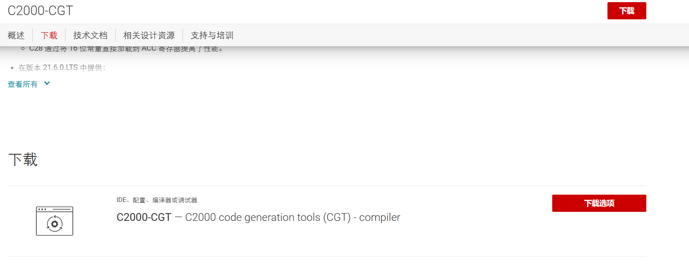
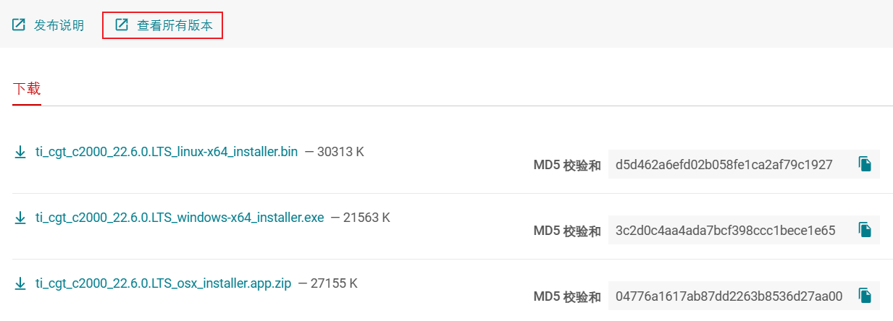
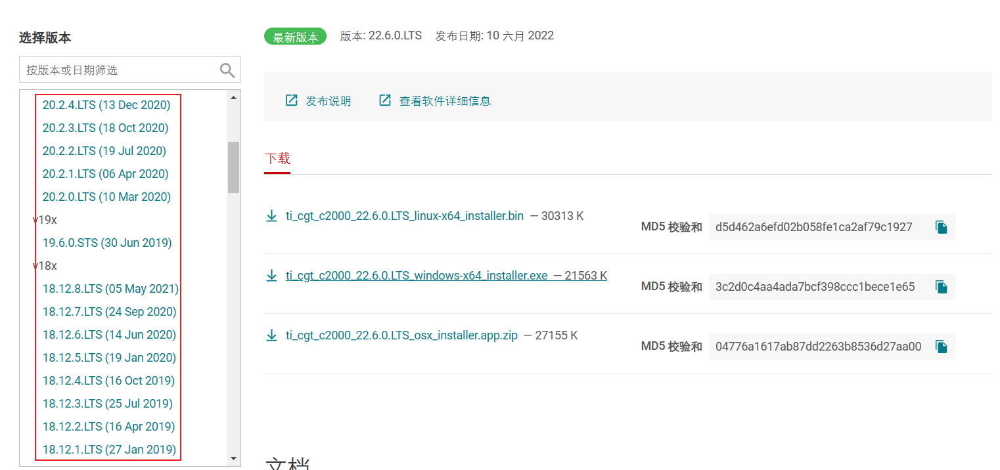
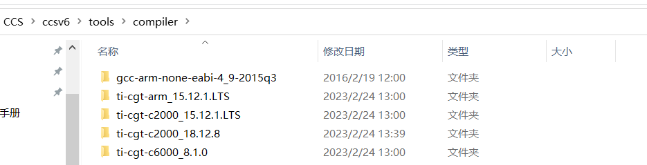

## 软件安装

#### CCS6软件安装

#### 编译器手动安装

- 到TI官网找CGTwww.ti.com.cn上搜索CGT，即可找到C2000-CGT:C2000代码生成工具-编译器。

- 点进去之后，点击“下载”=》“下载选项”

- 可以“查看所有版本”

-  找到所需版本后即可**下载**。

 

- 安装编译器在CCS软件目录下的compile目录下，并按照编译器名给文件夹命名

#### 配置编译器

- 打开项目属性

- 选择General，找到Compiler version,点击“more...”

- 点击“刷新”，新版本的就出来了。

## 文件说明

### APP 文件夹

​		用于存放用户编写的应用文件，如 LED、蜂鸣器、数码管、ADC
等文件，这样可有效的管理工程文件和提高我们代码的移植性。

### User 文件夹

用于存放用户编写的 main.c 等文件，用户编写的应用程序起
始位置即从 main 函数开始执行。

### DSP2833x_Libraries 文件夹

用于存放 TI 公司提供给我们开发 DSP2833x所需要的头文件、外设、内核、DSP 库、CMD 等文件。